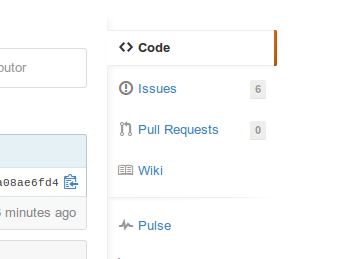
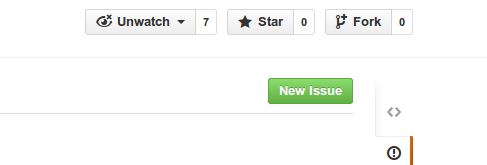

Work Tracking
=============

Empty repository for tracking work. Please [watch](https://help.github.com/articles/watching-repositories) this repository for email notification of new issues and comments. Also, checkout the [wiki](https://github.com/CodeClubHanoi/work-tracking/wiki).

To create a new issue:

1. Go to the [**Issues**](https://github.com/CodeClubHanoi/work-tracking/issues) page

   

2. Press the [**New Issue**](https://github.com/CodeClubHanoi/work-tracking/issues/new) button

   
